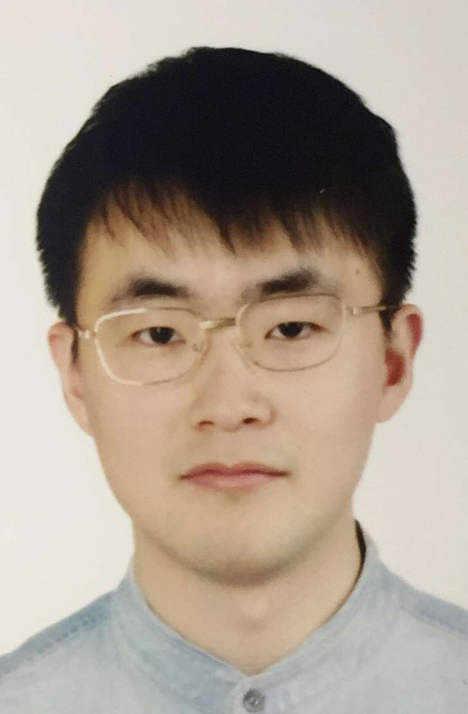

```{css echo=FALSE}
a{
  text-decoration: none;
  color: black;
}

a:hover{
  color: blue;
}

body{
  font-family: "Arial"
}
```


Aside
================================================================================


{width=60%}


### Contact Info {#contact}
<!----------------------------------------------------------------------------->

<!-- For more icons on https://fontawesome.com/ -->

- <i class="fa fa-envelope"></i> Shun.Bi@hereon.de
<!-- - <i class="fa fa-phone"></i> +86 156-5190-9539 -->
- <i class="fa fa-phone"></i> +49 152-5955-2657
- <i class="fa fa-github"></i> [github.com/bishun945](https://github.com/bishun945)
- <i class="fab fa-researchgate"></i> [Shun_Bi](https://www.researchgate.net/profile/Shun_Bi)
- <i class="fa fa-twitter"></i> [bishun945](https://twitter.com/bishun945)
- For more information, please contact me via email.


### Skills {#skills}
<!----------------------------------------------------------------------------->

- Experienced in atmospheric correction, Chla algorithm and optical water clustering.

- Full experience in remote sensing image processing.

- R, Python, IDL, MATLAB, SeaDAS, SNAP, Ubuntu, macOS.

### Languages 

Mandarin (native), English (written and oral)


Disclaimer {#disclaimer}
--------------------------------------------------------------------------------

This [**resume**](https://github.com/bishun945/CV) was created by [**pagedown**](https://github.com/rstudio/pagedown)

Online [html](https://bishun945.github.io/CV/) | Download [pdf](https://raw.githubusercontent.com/bishun945/CV/main/index.pdf) | [中文pdf](https://raw.githubusercontent.com/bishun945/CV/main/%E6%AF%95%E9%A1%BA%20%E7%AE%80%E5%8E%86%20%E4%B8%AD%E6%96%87.pdf)

Last updated on `r Sys.Date()`

Main
================================================================================

Shun Bi 毕顺 {#title}
--------------------------------------------------------------------------------


<!-- ### Currently searching for a PD position -->

My current interest is to build an algorithm blending framework for estimating optical active constitutes, such as Chlorophyll-a concentration, across Case I and II waters from remote sensing data. I am also interested in building Chla algorithms for specific water types (e.g., turbid Case II waters), column-integrated algal biomass for inland lakes, atmospheric correction, and data gap-filling for satellite imagery.

Work experience {data-icon=briefcase data-concise=true}
--------------------------------------------------------------------------------

### Helmholtz-Zentrum Hereon

Post-doc

Geesthacht, Germany

2021 - Now

Optical Oceanography, Institute of Coastal Ocean Dynamics

Education {data-icon=graduation-cap data-concise=true}
--------------------------------------------------------------------------------

### Nanjing Normal University

Ph.D in Remote Sensing of Geo-Environment

Nanjing, China

2016 - 2021

Thesis: Remote Sensing of Column-integrated Algal Biomass for Inland Waters Based on Soft Classification <br> (Qualified for the Successive Master-Doctor Program in 2018)

### Jiangsu Normal University

B.S. in Remote Sensing Science and Technology

Xuzhou, China

2012 - 2016

Thesis: Analysis of Spatiotemporal Characteristics of Drought in Qinghai-Tibet Region Based on Meteorological Drought Composite Index


Selected Publications {data-icon=book}
--------------------------------------------------------------------------------

### [Assessment of algorithms for estimating chlorophyll-a concentration in inland waters: A round-robin scoring method based on the optically fuzzy clustering](https://ieeexplore.ieee.org/document/9361570)

IEEE Transactions on Geoscience and Remote Sensing, *Early Access*, **IF  5.855**

N/A

2021

**Bi S**, Li Y, Liu G, Song K, Xu J, Dong X, Cai X, Mu M, Miao S, Lyu H

### [Optical classification of inland waters based on an improved Fuzzy C-Means method ](https://www.osapublishing.org/DirectPDFAccess/3EEC055A-6E95-41EE-8265DED3519E96F2_423176/oe-27-24-34838.pdf?da=1&id=423176&seq=0&mobile=no)

Optics Express, *27*(24), 34838–34856,  **IF 3.669**

N/A

2019

**Bi S**, Li Y, Xu J, Liu G, Song K, Mu M, Lyu H, Miao S, Xu J

### [Quantifying spatiotemporal dynamics of the column-integrated algal biomass in nonbloom conditions based on OLCI data: a case study of Lake Dianchi, China](https://ieeexplore.ieee.org/abstract/document/8718009) {.break-after-me}

IEEE Transactions on Geoscience and Remote Sensing, *57*(10), 7447–7459,  **IF 5.855**

N/A

2019

**Bi S**, Li Y, Lyu H, Mu M, Xu J, Lei S, Miao S, Hong T, Zhou L

### [Inland water atmospheric correction based on turbidity classification using OLCI and SLSTR synergistic observations](https://www.mdpi.com/2072-4292/10/7/1002) 

Remote Sensing, *10*(7), 1002, **IF 4.118**

N/A

2018

**Bi S**, Li Y, Wang Q, Lyu H, Liu G, Zheng Z, Du C, Mu M, Xu J, Lei S


### [Estimation of chlorophyll-a concentration in Lake Erhai based on OLCI data](http://www.jlakes.org/ch/reader/view_abstract.aspx?doi=10.18307/2018.0312)

Journal Lake Science, *30*(3), 701–712 (*in Chinese*), **IF 1.445**

N/A

2018

**Bi S**, Li Y, Lu H, Zhu L, Mu M, Lei S, Wen S, Ding X


<!-- others -->
### [Tracking spatio-temporal dynamics of POC sources in eutrophic lakes by remote sensing](https://www.sciencedirect.com/science/article/pii/S0043135419309364)

Water Research, *168*, 115162, **IF 9.13**

N/A

2020

Xu J, Lei S, **Bi S**, Li Y, Lyu H, Xu J, Xu X, Mu M, Miao S, Zeng S & others

### [An OLCI-based algorithm for semi-empirically partitioning absorption coefficient and estimating chlorophyll a concentration in various turbid case-2 waters ](https://www.sciencedirect.com/science/article/pii/S0034425720300171)

Remote Sensing of Environment, *239*, 111648, **IF 9.085**

N/A

2020

Liu G, Li L, Song K, Li Y, Lyu H, Wen Z, Fang C, **Bi S**, Sun X, Wang Z & others


### [Simultaneous inversion of concentrations of POC and its endmembers in lakes: A novel remote sensing strategy](https://www.sciencedirect.com/science/article/pii/S0048969721003156)

Science of the Total Environment, *770*, 145249, **IF 6.551**

N/A

2021

Xu J, Li Y, Lyu H, Lei S, Mu M, **Bi S**, Xu J, Xu X, Miao S, Li L, & others


### [Characteristics of the chromophoric dissolved organic matter of urban black-odor rivers using fluorescence and UV-visible spectroscopy](https://www.sciencedirect.com/science/article/pii/S0269749120364526)

Environmental Pollution, *268*, 115763, **IF 6.793**

N/A

2021

Miao S, Lyu H, Xu J, **Bi S**, Guo H, Mu M, Lei S, Zeng S, Liu H


R Packages {data-icon=cubes}
--------------------------------------------------------------------------------

### [FCMm: Water spectra fuzzy-clustering, algorithm assessment, and blending](https://github.com/bishun945/FCMm)

Version 0.11.1

N/A

2021

**Bi S**, Li Y, Liu G


### [DAMATO: Data Management Toolbox](https://github.com/bishun945/DAMATO)

Version 0.0.8

N/A

2021

**Bi S**, Li Y, Cheng X

### [Algal Game: Solver of the reaction-diffusion-taxis model of phytoplankton, nutrients, and light in water column](https://github.com/bishun945/AlgalGame)

Version 0.1

N/A

2021

**Bi S**, Li Y, Li J

### [seadasr: Running seadas with R](https://github.com/bishun945/seadasr)

Version 0.0.1 (*private*)

N/A

2020

**Bi S**, Liu G, Li Y


### [TSSIM: Time-Series-based Spatial Interpolation Method](https://github.com/bishun945/TSSIM)

Version 0.0.2 (*private*)

N/A

2019

**Bi S**, Li Y


Awards and Honors {data-icon=award}
--------------------------------------------------------------------------------

### the Third Prize of 2017 NNU Graduate Mathematical Modeling Competition

Title: Research on Feature Selection and Classifier Algorithm in Intrusion Detection (*in Chinese*)

N/A

2017

Bi S, Chen B, Ding X

### the Second Prize of 2017 National Graduate Mathematical Modeling Competition

Title: Foreground target extraction based on surveillance video (*in Chinese*)

N/A

2017

Bi S, Chen B, Ding X

### ESA-MOST China Dragon 4 Cooperation: BEST POSTER AWARD

Title: Inland water atmospheric correction based on turbidity classification using OLCI and SLSTR synergistic observations

N/A

2018

### [the Third Prize of the 6th Sharing Cup College Student Science and Technology Resources sharing serveice innovation competition](http://www.escience.net.cn/nav/index/prize/details?awardId=29)

Title: Evaluation of atmospheric correction methods for inland lakes based on Sentinel-3 OLCI data (*in Chinese*)

N/A

2018

Bi S, Hong T, Zhou L


### [the First Prize of the 1st Hyerspectral Imagery Processing Competition - Orbit Cup](https://ohs.obtdata.com/#/newsDetail?id=12)

Title: Evaluation of the application of ZH-1 data in remote sensing of water color in inland lakes (*in Chinese*)

N/A

2019

Bi S, Hong T, Li L

### Outstanding Graduate in Nanjing Normal University

N/A

N/A

2021


Grants and Fellowships {data-icon=hands-helping}
--------------------------------------------------------------------------------

### Postgraduate Research & Practice Innovation Program of Jiangsu province, China

Project title: Research on the three-dimensional spatiotemporal pattern of the total biomass of cyanobacteria in Taihu Lake based on remote sensing technology (*in Chinese*)

N/A

2018

### China National Scholarship

Funded by Ministry of Education of the People's Republic of China

N/A

2020

### Scholarship of Saiteng Fenghui

Funded by Suzhou Secote Precision Electronic Co., Ltd.

N/A

2019

### the First Prize Scholarship

Funded by Nanjing Normal University

N/A

2017 - 2020

### the Second Prize Scholarship

Funded by Nanjing Normal University

N/A

2016


Conferences and Presentations {data-icon=chalkboard}
--------------------------------------------------------------------------------

### [Looking back on my PhD](https://bishun945.github.io/Looking-back-on-my-PhD/)

N/A

Nanjing, China

2021


### [ALGAL GAME](https://bishun945.github.io/presentation20201216/)

N/A

Nanjing, China

2020


### National Forum for Doctoral Students in Geographic Information Science

N/A

Online

2020

### the 2nd Wetland Remote Sensing Conference in China

N/A

Online

2020

### the 19th Water Color Remote Sensing Conference in China

N/A

Sanya, China

2019

### the 1st Wetland Remote Sensing Conference in China

N/A

Changchung, China

2019

### the 18th Water Color Remote Sensing Conference in China

N/A

Zhanjiang, China

2018

### National Forum for Doctoral Students in Geographic Information Science

N/A

Nanjing, China

2018

### ESA-MOST DRAGON 4 PROGRAMME - Advanced Training Course in Ocean & Coastal Remote Sensing

N/A

Shenzhen, China

2018

### Jiangsu University Geography Postgradutae Forum

N/A

Nanjing, China

2018

### the 1st China Plateau Lake Forum

N/A

Kunming, China

2017

### the 5th Graduate Forum of Jiangsu Society of Oceanology and Lomnology

N/A

Nanjing, China

2017

### Jiangsu University Geography Postgradutae Forum

N/A

Nanjing, China

2017


<!-- ::: aside -->
<!-- #### References -->

<!-- Yunmei Li, Ph.D., Professor <br> -->
<!-- School of Geography <br> -->
<!-- Nanjing Normal University <br> -->
<!-- Nanjing, China <br> -->
<!-- liyunmei@njnu.edu.cn -->

<!-- ::: -->


